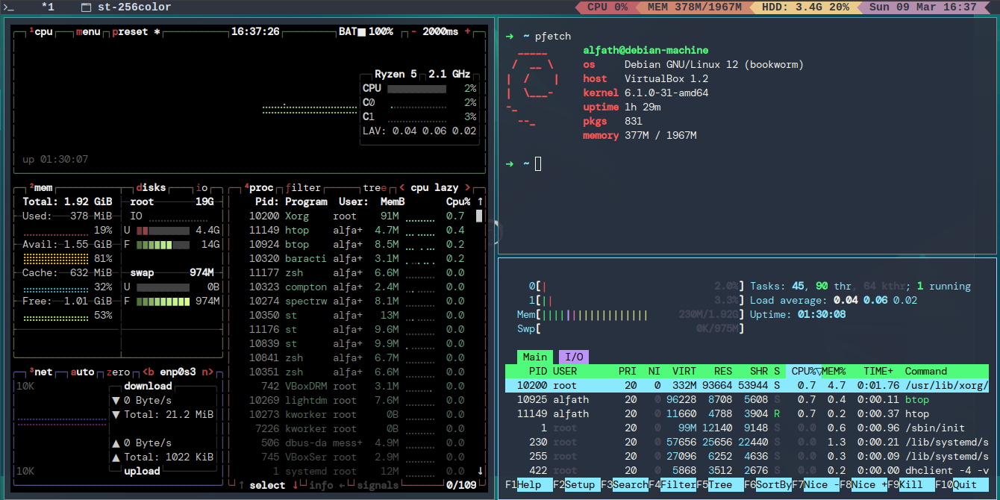

# alfath-spectrwm
My Spectrwm config

## Features
1. beautiful bar with useful information wwith baraction
2. lightweight
3. Highly customizeable, only using config

## Dependencies
1. Spectrwm
2. [alfath-dmenu](https://github.com/alfathmuqoddas/alfath-dmenu)
3. [alfath-st](https://github.com/alfathmuqoddas/alfath-st1)
4. [fonts-cool](https://github.com/alfathmuqoddas/fonts-cool)
5. lightdm
6. lightdm-gtk-greeter
7. xsecurelock
8. pactl

## Guides
1. Install all the dependencies
2. copy `.spectrwm.conf` and `baraction.sh` to home directory or `~`
3. press `Win + r` to restart the spectrwm

## Screenshot

